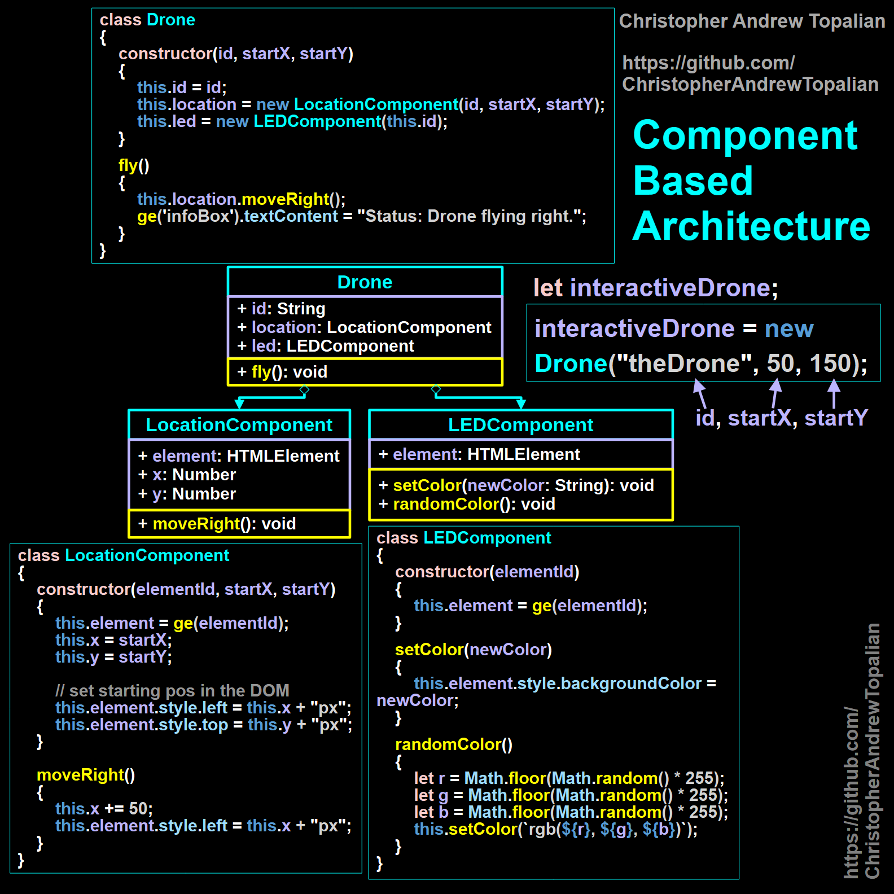
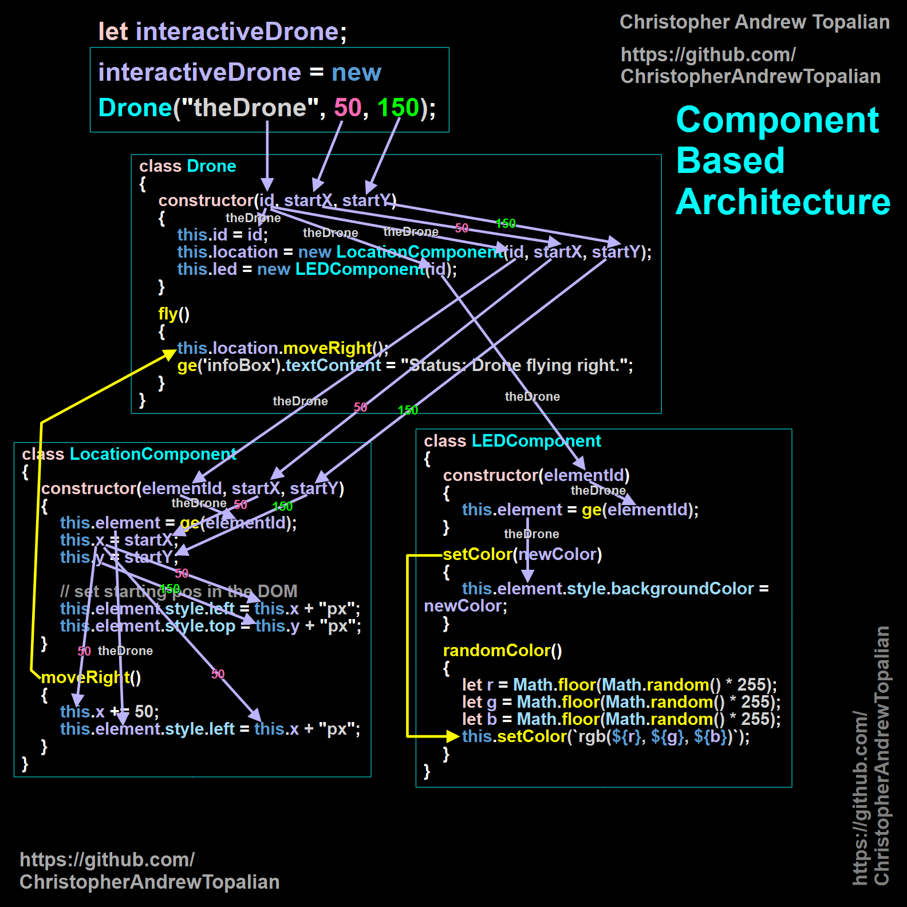

# CATopalian JavaScript Component Based Architecture
This JS app teaches the pattern that AAA Game Studios use to program things such as GTA5 and other big game studio titles.

---

Use App: https://christopherandrewtopalian.github.io/CATopalian_JavaScript_Component_Based_Architecture/CATopalian_JavaScript_Component_Based_Architecture.html

---

### How to Download this App
1. **Click** the green **Code Button** on this github page
2. Choose **Download ZIP**
3. **Save** the **Zip File**
4. **Extract All**
5. **Double click** the **HTML file** to start the App

---

Happy Scripting :-)

---

// Dedicated to God the Father  
// All Rights Reserved Christopher Andrew Topalian Copyright 2000-2026  
// https://github.com/ChristopherTopalian  
// https://github.com/ChristopherAndrewTopalian  
// https://sites.google.com/view/CollegeOfScripting
